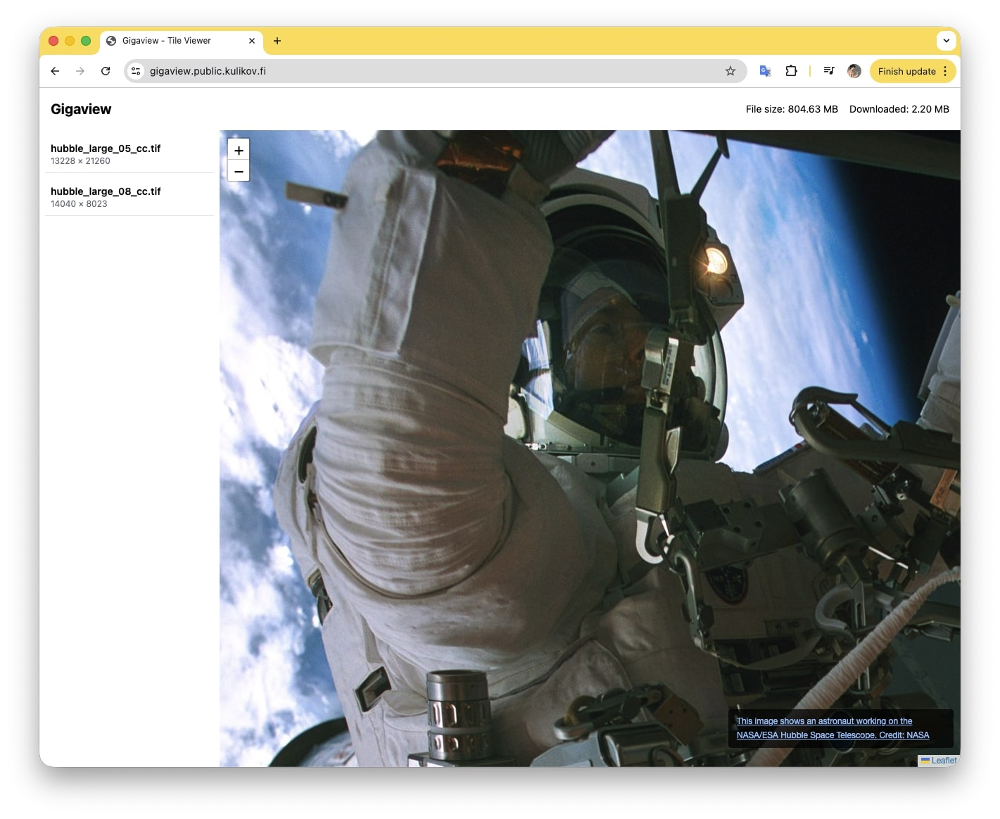

# Gigaview - On-Demand Tile Viewer for Gigapixel Images

A demo project showing how to render gigapixel images in the browser using on-demand tile rendering. This is a proof-of-concept implementation, not production-ready code.

**Live Demo:** [https://gigaview.public.kulikov.fi/](https://gigaview.public.kulikov.fi/)

*Note: The live demo collects basic visit statistics to understand usage patterns.*



## Technologies

- **[libvips](https://www.libvips.org/)** + **[github.com/cshum/vipsgen](https://github.com/cshum/vipsgen)**: Essential for processing multi-gigabyte images without loading entire files into memory. Uses memory-mapped files and processes images in chunks, making it possible to work with gigapixel images even on servers with limited RAM.
- **[Leaflet](https://leafletjs.com/)**: Excellent tool for working with maps and tile layers. Provides smooth pan/zoom functionality and handles tile loading efficiently. As a bonus point even possible to add annotation to picture if needed with the same API as for maps.
- **Go**: Backend language of choice (I'm not a professional Go developer, but I really enjoy the language and wanted to use it for this project).

## Quick Start

### Using Docker Compose (Recommended)

1. Place your images in the `data/` directory:

   ```bash
   # Copy your images to data/
   ```

   I would suggest to use some images from:

   - https://esahubble.org/images/hubble_large_05_cc/
   - https://esahubble.org/images/heic1502a/

2. Start the server:

   ```bash
   docker-compose up --build
   ```

3. Open http://localhost:8080 in your browser

4. Stop the server:
   ```bash
   docker-compose down
   ```

### Using Docker

1. Build the image:

   ```bash
   docker build -t gigaview .
   ```

2. Run the container:
   ```bash
   docker run -d \
     -p 8080:8080 \
     -v /path/to/your/images:/data \
     -e PORT=8080 \
     gigaview
   ```

### Running on Host System

**Note:** I've only used this project in Docker without installing anything on the host system. If you need to run it directly on your host, you may need to install libvips first. Check the [libvips installation guide](https://www.libvips.org/install.html) for your system.

## Configuration

### Environment Variables

| Variable             | Default                 | Description                                                                       |
| -------------------- | ----------------------- | --------------------------------------------------------------------------------- |
| `PORT`               | `8080`                  | HTTP server port                                                                  |
| `DATA_DIR`           | `/data`                 | Directory containing images                                                       |
| `CACHE`              | `memory`                | Cache type: `memory`, `file`, or `disabled`                                       |
| `CACHE_MEMORY_TILES` | `2000`                  | Maximum number of tiles in memory cache (only for `memory` cache)                 |
| `CACHE_FILE_DIR`     | `{DATA_DIR}/cache`      | Directory for file cache (only for `file` cache)                                  |
| `WARMUP_LEVELS`      | `1`                     | Number of zoom levels to pre-render (0 to disable)                                |
| `WARMUP_WORKERS`     | `1`                     | Number of concurrent workers for warmup                                           |
| `VIPS_MAX_CACHE_MB`  | `256`                   | Maximum memory for libvips cache (MB)                                             |
| `VIPS_CONCURRENCY`   | `1`                     | Number of concurrent libvips operations                                           |
| `LOG_LEVEL`          | `info`                  | Logging level (`debug`, `info`, `warn`, `error`)                                  |
| `UPLOAD_TOKEN`       | (empty)                 | Token for upload authentication (empty = public upload)                           |
| `MAX_UPLOAD_SIZE`    | `4294967296`            | Maximum upload size in bytes (default 4GB)                                        |
| `ALLOWED_ORIGIN`     | (empty)                 | Allowed CORS origin (empty = same-origin only)                                    |
| `PUBLIC_BASE_URL`    | `http://localhost:8080` | Public base URL for the application                                               |
| `GOMAXPROCS`         | (auto)                  | Number of OS threads Go scheduler may run (defaults to number of CPU cores)       |
| `GOMEMLIMIT`         | (unlimited)             | Soft limit for Go heap usage (e.g., `400MiB`, `1GiB`)                             |
| `GOGC`               | `100`                   | GC aggressiveness: lower = more frequent GC, higher = less frequent (default 100) |

### Performance Tuning

These settings allow you to balance between performance and resource usage:

- **`GOMAXPROCS`**: By default, Go uses all available CPU cores. If you need to limit CPU usage to keep your server responsive, set this to a lower value (e.g., `2` or `4`). Leave it unset to use all cores for maximum performance.
- **`VIPS_CONCURRENCY`**: Controls parallel image processing in libvips. Higher values (e.g., `4` or `8`) speed up tile rendering but use more CPU and memory. Lower values (e.g., `1` or `2`) save resources but are slower.
- **`VIPS_MAX_CACHE_MB`**: libvips internal cache size. If you have plenty of RAM, increase this (e.g., `512` or `1024`) for better performance. If memory is critical, decrease it (e.g., `128` or `256`), but this will reduce speed.
- **`CACHE`**:
  - `memory` cache is fast but uses RAM and is lost on restart
  - `file` cache persists across restarts and helps with warmup, but uses disk space. Use it if you want to pre-warm images and don't mind using disk space.
- **`CACHE_MEMORY_TILES`**: Only applies to `memory` cache. Higher values cache more tiles in RAM (faster) but use more memory. Lower values save memory but may cause more re-rendering.
- **`GOMEMLIMIT`** and **`GOGC`**: Use these to control Go's memory usage. Set `GOMEMLIMIT` to cap heap usage if memory is constrained. Adjust `GOGC` - lower values (e.g., `50`) trigger GC more frequently and use less memory, higher values (e.g., `200`) use more memory but GC less often.

**Example: Minimal resource usage** (server stays responsive, low RAM usage):

```bash
GOMAXPROCS=2
VIPS_CONCURRENCY=1
VIPS_MAX_CACHE_MB=128
CACHE=file
GOMEMLIMIT=300MiB
GOGC=50
WARMUP_LEVELS=1
```

**Example: Maximum performance** (32GB RAM, 16 CPU cores, GOMAXPROCS not set):

```bash
VIPS_CONCURRENCY=8
VIPS_MAX_CACHE_MB=4096
CACHE=memory
CACHE_MEMORY_TILES=10000
GOGC=100
WARMUP_WORKERS=8
```

### Cache Types

Two cache implementations are available:

- **`memory`** (default): In-memory LRU cache. Fast and disk-efficient, but all cached tiles are lost on server restart.
- **`file`**: File-based cache that persists across restarts. Tiles are stored on disk, so cache survives server restarts, but uses disk space.

## Supported Formats

**Input formats:** `.tif`, `.tiff`, `.jpg`, `.jpeg`, `.png`, `.webp`

**Output tile format:** JPEG (256×256 tiles)

### Format Recommendations

For **very large images** (gigapixel images), **TIFF format is strongly recommended**. TIFF files are designed for large images and work efficiently with memory-mapped file access, allowing libvips to process them without loading the entire file into memory.

**PNG files can require significantly more memory** when processing large images, as they may need to be fully decompressed into memory. For gigapixel images, PNG can consume excessive amounts of RAM and may cause performance issues or memory errors.

## Features

- On-demand tile rendering (256×256 tiles)
- Support for large TIFF/BigTIFF files
- Smooth pan/zoom with Leaflet
- Image upload endpoint with optional token authentication
- Download tracking (shows how much data was downloaded)
- LRU tile caching (memory or file-based)
- CORS protection

## Development local

### Prerequisites

- Go 1.25+
- libvips development libraries (see [libvips installation](https://www.libvips.org/install.html))
- Docker (for containerized builds)

### Build

```bash
go build ./cmd/server
```

## Architecture

- **Backend**: Go with standard `net/http`
- **Image Processing**: [libvips](https://www.libvips.org/) via govips
- **Logging**: Uber zap (JSON format)
- **Caching**: LRU cache (in-memory or file-based)
- **Frontend**: Single-page application with Leaflet and Tailwind CSS
- **Storage**: No database - images from filesystem

Main action is happening in two files: main.js (frontend) and renderer.go (backend)

## Author

Created by [Dmitrii Kulikov](https://kulikov.fi)

## Note

I'm not a professional Go developer, but I really enjoy the language and wanted to use it for this project. This code is provided as-is for demonstration purposes.

**Important:** The goal of this project was to demonstrate the product and the idea, not to write perfect code. Therefore, the code is not ideal in some places.

### Possible Improvements

- **Lossless quality at maximum zoom**: At maximum zoom level, it might be better to serve images without quality loss instead of compressed JPEG tiles.
- **Warmup algorithm optimization**: The current warmup algorithm is not optimized and could be improved for better performance.

### Similar Projects

This project is not unique, as there are similar solutions available. For example:

- **[OpenSeadragon](https://openseadragon.github.io/)** - An open-source, web-based viewer for high-resolution zoomable images, implemented in pure JavaScript.

## License

This project is provided as-is, without any warranties or guarantees. I assume no responsibility for any issues, damages or consequences arising from the use of this code.

You are free to use, modify, and distribute this code for any purpose. However, if you use this work as a basis for your own project, please mention me as the original author.

Note: This project uses third-party libraries (libvips, Leaflet, etc.) which have their own licenses. Make sure to comply with their respective license terms.
